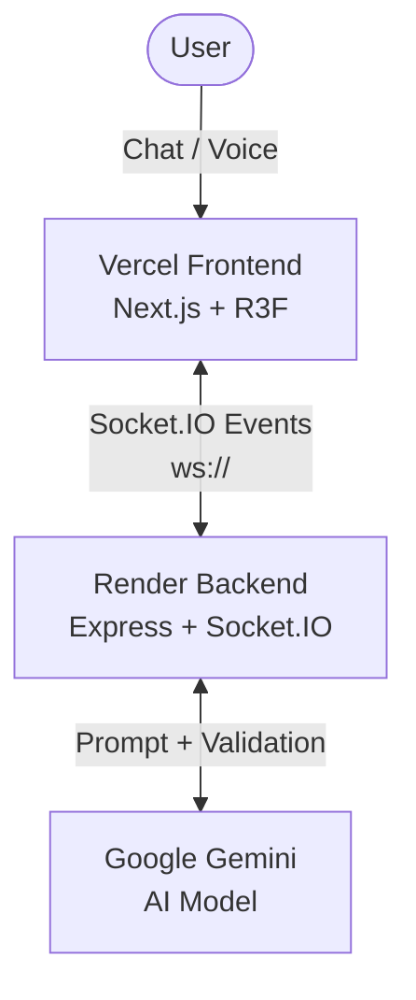

<div align="center">

# 🚀 SyncSpace AI
**The Visual Sales Co-Pilot & 3D Workspace Architect**

[](https://nextjs.org/)
[](https://reactjs.org/)
[](https://www.typescriptlang.org/)
[](https://socket.io/)
[](https://deepmind.google/technologies/gemini/)
[](https://opensource.org/licenses/MIT)

*Design your dream premium workstation setup via natural language in real-time.*

</div>

---

## 🌟 Live Application

| Service | URL |
|---------|-----|
| **Frontend (Vercel)** | [https://sync-space-ai.vercel.app](https://sync-space-ai.vercel.app) |
| **Backend (Render)** | [https://syncspace-ai.onrender.com](https://syncspace-ai.onrender.com) |

## ✨ Feature Highlights
- 🧠 **AI-Powered Generation**: Chat with Gemini 2.5 Flash to generate complex workspace configurations.
- 🧊 **Real-Time 3D Canvas**: Visualize your setup instantly using React Three Fiber.
- 💰 **Live Pricing & Analytics**: Track budget, ROI, ergonomics, and productivity scores dynamically.
- 🎙️ **Voice Input**: Talk directly to the AI co-pilot to optimize or redesign the setup.
- ⚡ **Real-Time Socket Sync**: Lightning-fast state updates powered by Socket.IO.
- 💾 **Export System**: Export the customized 3D workstation setup configuration as JSON or images.

## 💻 Tech Stack
- **Frontend**: Next.js 16 (App Router), React 19, React Three Fiber, Zustand, Tailwind CSS v4, Framer Motion.
- **Backend**: Node.js, Express 5, Socket.IO 4, Google Gemini AI SDK (`@google/genai`), TypeScript.

## 🏗️ Production Architecture



## 📸 Screenshots
*(Insert screenshots of the 3D visualizer and live engine UI here)*
- Placeholder: `docs/assets/canvas-view.png`
- Placeholder: `docs/assets/analytics-panel.png`

---

## 🚀 Installation & Local Development Setup

### 1. Clone the Repository
```bash
git clone https://github.com/Tiku57/SyncSpace-AI.git
cd SyncSpace-AI
```

### 2. Environment Variables
You need to set up `.env` files for both the frontend and backend.

**Frontend (`frontend/.env`)**:
```env
NEXT_PUBLIC_SOCKET_URL=https://syncspace-ai.onrender.com
```

**Backend (`backend/.env`)**:
```env
PORT=10000
FRONTEND_URL=https://sync-space-ai.vercel.app
GEMINI_API_KEY=YOUR_GEMINI_API_KEY
```

### 3. Install & Run
Open two terminal instances.

**Terminal 1 (Backend)**:
```bash
cd backend
npm install
npm run dev
```

**Terminal 2 (Frontend)**:
```bash
cd frontend
npm install
npm run dev
```

Open [http://localhost:3000](http://localhost:3000) to view the application locally.

---

## 📂 Folder Structure
```text
SyncSpace-AI/
├── frontend/                 # Next.js Application
│   ├── app/                  # App Router
│   ├── components/           # React / R3F Components
│   ├── store/                # Zustand state management
│   ├── lib/                  # Utilities and Types
│   └── public/               # Static assets (3D models, textures)
└── backend/                  # Node.js + Express + Socket.IO Server
    ├── src/
    │   ├── index.ts          # Server entrypoint
    │   ├── socket/           # WebSocket event handlers
    │   └── services/         # Gemini AI, Layout Engine, Analytics
    ├── package.json
    └── tsconfig.json
```

---

## 🎬 Live Hackathon Demo

This application includes a custom 4-step sequence mode optimized for rapid live presentations.

**STEP 1**
Build a premium dual-monitor software engineer workstation using a standing desk.

**STEP 2**
Upgrade the monitors to LG C3 OLEDs and add an audio system.

**STEP 3**
Add a 55-inch wall-mounted OLED TV and a cup of chai.

**STEP 4**
Clear everything and build a minimalist Mac Studio setup on an Ikea desk.

---

## 🌐 Production Deployment

This project is configured for cloud deployment across Vercel (Frontend) and Render (Backend).

### Backend (Render)
1. Connect the repository to [Render](https://render.com/).
2. Create a **Web Service**.
3. Set the build command to: `cd backend && npm install && npm run build`
4. Set the start command to: `cd backend && npm start`
5. Add the environment variables: `PORT=10000`, `GEMINI_API_KEY`, and `FRONTEND_URL=https://sync-space-ai.vercel.app`.

### Frontend (Vercel)
1. Import the repository into [Vercel](https://vercel.com/).
2. Set the **Root Directory** to `frontend`.
3. Add the environment variable: `NEXT_PUBLIC_SOCKET_URL=https://syncspace-ai.onrender.com`.
4. Deploy!

### ✅ Deployment Verification Checklist
- [x] Frontend loads successfully via Vercel.
- [x] Backend responds on health check endpoint.
- [x] "Live Engine" indicator becomes green/online.
- [x] Socket connection successfully establishes (CORS validated).
- [x] AI workspace generation successfully renders 3D components.
- [x] Analytics panel updates with physical values.
- [x] Live pricing updates accurately.
- [x] Setup Export (JSON/Image) downloads cleanly.

---

## 🤝 Contribution Guide
1. Fork the Project
2. Create your Feature Branch (`git checkout -b feature/AmazingFeature`)
3. Commit your Changes (`git commit -m 'Add some AmazingFeature'`)
4. Push to the Branch (`git push origin feature/AmazingFeature`)
5. Open a Pull Request

## 📜 License
Distributed under the MIT License.

## 👨‍💻 Author
**Tiku57** - [GitHub](https://github.com/Tiku57)
