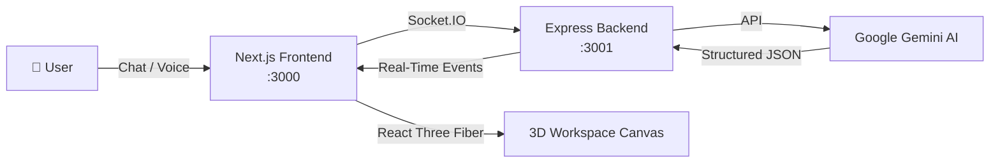

<p align="center">
  <h1 align="center">🚀 SyncSpace AI</h1>
  <p align="center"><strong>Your Visual Sales Co-Pilot — Design Premium Workstation Setups with AI in Real-Time</strong></p>
</p>

<p align="center">
  
  
  
  
  
  
</p>

---

SyncSpace AI transforms how businesses sell premium workstation setups. Chat with an AI co-pilot that **generates**, **upgrades**, and **optimizes** 3D workstation layouts — all through natural language. Watch configurations materialize in a live 3D canvas, get instant pricing analytics, and export production-ready quotes in seconds.

---

## ✨ Feature Highlights

| Feature | Description |
| :--- | :--- |
| 🖥️ **Real-Time 3D Workspace Canvas** | Interactive React Three Fiber scene — rotate, zoom, and inspect every component in a photorealistic workspace. |
| 🤖 **AI-Powered Workspace Generation** | Powered by Google Gemini. Describe what you need in plain English and watch it build. |
| 💰 **Live Pricing Analytics** | Real-time cost breakdowns, category splits, and per-item pricing as you design. |
| 📊 **Budget Optimization** | Tell the AI your budget and it restructures the entire setup to fit — without sacrificing quality. |
| 📦 **Export System** | Export workspace configurations as structured JSON for downstream integrations. |
| 🎙️ **Voice Input** | Speak your workspace requirements using the built-in Web Speech API integration. |
| ⚡ **Live Hackathon Demo Mode** | A guided 4-step walkthrough that showcases every capability in under 3 minutes. |
| 🔄 **Real-Time Sync** | Socket.IO–powered bi-directional communication keeps the 3D canvas perfectly in sync with AI output. |

---

## 🛠️ Tech Stack

### Frontend

| Technology | Role |
| :--- | :--- |
| [Next.js 16](https://nextjs.org/) | React framework with App Router |
| [React 19](https://react.dev/) | UI library |
| [React Three Fiber](https://docs.pmnd.rs/react-three-fiber) | Declarative 3D scene graph (Three.js) |
| [@react-three/drei](https://github.com/pmndrs/drei) | Helpers & abstractions for R3F |
| [Zustand](https://zustand-demo.pmnd.rs/) | Lightweight global state management |
| [Tailwind CSS v4](https://tailwindcss.com/) | Utility-first styling |
| [Framer Motion](https://www.framer.com/motion/) | Declarative animations |
| [Socket.IO Client](https://socket.io/) | Real-time server communication |
| [Recharts](https://recharts.org/) | Charting for pricing analytics |
| [Lucide React](https://lucide.dev/) | Icon library |

### Backend

| Technology | Role |
| :--- | :--- |
| [Express 5](https://expressjs.com/) | HTTP server framework |
| [Socket.IO 4](https://socket.io/) | Real-time WebSocket layer |
| [@google/genai](https://ai.google.dev/) | Google Gemini AI SDK |
| [TypeScript](https://www.typescriptlang.org/) | Type-safe server code |
| [tsx](https://github.com/privatenumber/tsx) | TypeScript execution for dev |
| [dotenv](https://github.com/motdotla/dotenv) | Environment variable management |

---

## 🏗️ Architecture Overview

SyncSpace AI is structured as a **monorepo** with two independent packages:

```
syncspace-ai/
├── frontend/   →  Next.js 16 application (port 3000)
├── backend/    →  Express 5 + Socket.IO server (port 3001)
├── .gitignore
├── LICENSE
└── README.md
```



**Data flow:**

1. The user sends a natural-language prompt (text or voice) from the frontend.
2. The frontend emits the message over **Socket.IO** to the backend.
3. The backend forwards the prompt to **Google Gemini**, requesting a structured workspace JSON response.
4. Gemini returns a complete workspace configuration (items, positions, prices, categories).
5. The backend broadcasts the parsed workspace back to the frontend via Socket.IO.
6. The frontend renders the workspace in a live **React Three Fiber** 3D scene with pricing analytics.

---

## 🚀 Getting Started

### Prerequisites

- **Node.js** ≥ 18
- **npm** ≥ 9
- A [Google Gemini API key](https://aistudio.google.com/apikey)

### 1. Clone the Repository

```bash
git clone https://github.com/Tiku57/syncspace-ai.git
cd syncspace-ai
```

### 2. Install Dependencies

```bash
# Frontend
cd frontend && npm install

# Backend
cd ../backend && npm install
```

### 3. Set Up Environment Variables

```bash
# Frontend
cp frontend/.env.example frontend/.env.local

# Backend
cp backend/.env.example backend/.env
```

Edit `backend/.env` and add your Gemini API key:

```
GEMINI_API_KEY=your_actual_gemini_api_key
```

### 4. Start the Backend

```bash
cd backend && npm run dev
```

The server will start on **http://localhost:3001**.

### 5. Start the Frontend

In a new terminal:

```bash
cd frontend && npm run dev
```

The app will be available at **http://localhost:3000**.

### 6. Open the App

Navigate to [http://localhost:3000](http://localhost:3000) in your browser and start designing workspaces!

---

## 🔐 Environment Variables

### Frontend (`frontend/.env.local`)

| Variable | Description | Default |
| :--- | :--- | :--- |
| `NEXT_PUBLIC_SOCKET_URL` | URL of the Socket.IO backend server | `http://localhost:3001` |

### Backend (`backend/.env`)

| Variable | Description | Default |
| :--- | :--- | :--- |
| `PORT` | Port for the Express server | `3001` |
| `FRONTEND_URL` | Allowed CORS origin (frontend URL) | `http://localhost:3000` |
| `GEMINI_API_KEY` | Your Google Gemini API key | — *(required)* |

---

## 📁 Project Structure

```
syncspace-ai/
│
├── frontend/
│   ├── public/                    # Static assets
│   ├── src/
│   │   ├── app/                   # Next.js App Router pages & layout
│   │   ├── components/
│   │   │   ├── canvas/            # React Three Fiber 3D scene components
│   │   │   ├── chat/              # Chat panel, message bubbles, voice input
│   │   │   ├── analytics/         # Pricing charts, budget breakdown
│   │   │   ├── export/            # Export modal & JSON download
│   │   │   └── ui/               # Shared UI primitives
│   │   ├── store/                 # Zustand global state
│   │   ├── hooks/                 # Custom React hooks
│   │   ├── lib/                   # Utilities & Socket.IO client setup
│   │   └── types/                 # TypeScript type definitions
│   ├── .env.example
│   ├── tailwind.config.ts
│   ├── tsconfig.json
│   ├── next.config.ts
│   └── package.json
│
├── backend/
│   ├── src/
│   │   ├── index.ts               # Express + Socket.IO server entry
│   │   ├── gemini.ts              # Gemini AI service & prompt engineering
│   │   ├── socket.ts              # Socket.IO event handlers
│   │   └── types.ts               # Shared type definitions
│   ├── .env.example
│   ├── tsconfig.json
│   └── package.json
│
├── .gitignore
├── LICENSE
└── README.md
```

---

## 🎬 Demo Mode — Hackathon Walkthrough

SyncSpace AI includes a **built-in demo mode** designed for live presentations and hackathon judges. It walks through four scripted steps that showcase every major feature:

| Step | Action | What It Demonstrates |
| :---: | :--- | :--- |
| **1** | 🖥️ *"Create a premium developer workstation setup"* | AI workspace generation, 3D rendering, live pricing |
| **2** | ⬆️ *"Upgrade to a 4K ultra-wide monitor and ergonomic chair"* | Incremental workspace modification, price recalculation |
| **3** | 💰 *"Optimize this setup for a $3,000 budget"* | Budget optimization, intelligent cost reduction |
| **4** | 📦 *"Export workspace configuration"* | JSON export, clipboard copy, download |

> [!TIP]
> Click the **"▶ Start Demo"** button in the top navigation bar to begin the guided walkthrough. Each step auto-sends a prompt to the AI and waits for the response before advancing.

---

## 🤝 Contributing

Contributions are welcome! Please open an issue or submit a pull request.

1. Fork the repository
2. Create a feature branch (`git checkout -b feature/amazing-feature`)
3. Commit your changes (`git commit -m 'Add amazing feature'`)
4. Push to the branch (`git push origin feature/amazing-feature`)
5. Open a Pull Request

---

## 📄 License

This project is licensed under the **MIT License** — see the [LICENSE](LICENSE) file for details.

---

<p align="center">
  Built with ❤️ by <a href="https://github.com/Tiku57"><strong>Tiku57</strong></a>
</p>
