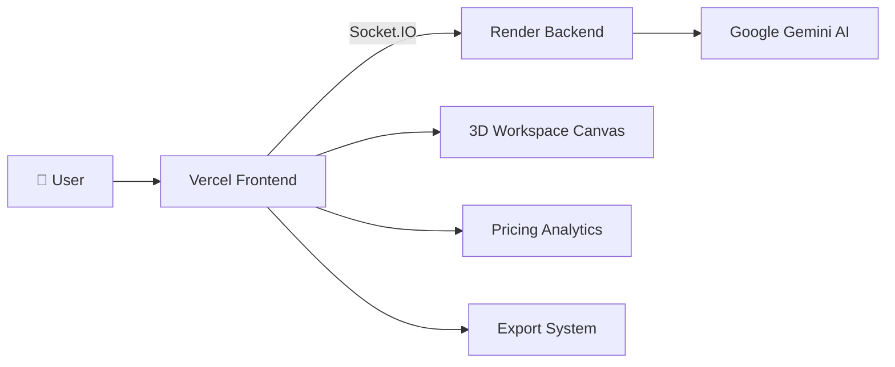

## 🚀 Production Deployment

### 🌐 Live Application

| Service           | URL                               |
| ----------------- | --------------------------------- |
| Frontend (Vercel) | https://sync-space-ai.vercel.app  |
| Backend (Render)  | https://syncspace-ai.onrender.com |

---

### Backend Deployment (Render)

SyncSpace AI backend is deployed on Render and provides:

* Gemini AI integration
* Socket.IO real-time communication
* Workspace generation engine
* Analytics calculations
* Pricing engine

#### Environment Variables

Configure the following variables inside Render:

```env
PORT=10000
GEMINI_API_KEY=YOUR_GEMINI_API_KEY
FRONTEND_URL=https://sync-space-ai.vercel.app
```

#### Production Backend URL

```text
https://syncspace-ai.onrender.com
```

---

### Frontend Deployment (Vercel)

The frontend is deployed on Vercel using the `frontend` directory as the project root.

#### Environment Variables

Configure the following variable inside Vercel:

```env
NEXT_PUBLIC_SOCKET_URL=https://syncspace-ai.onrender.com
```

#### Production Frontend URL

```text
https://sync-space-ai.vercel.app
```

---

## 🔌 Production Architecture



### Runtime Flow

1. User sends a workspace request.
2. Frontend emits the request through Socket.IO.
3. Backend processes the request.
4. Gemini generates a structured workspace response.
5. Backend converts the response into workspace actions.
6. Workspace state is synchronized back to the frontend.
7. React Three Fiber renders the updated 3D workspace.
8. Pricing and analytics update automatically.

---

## 🧪 Deployment Verification Checklist

After deployment verify:

### Backend

Visit:

```text
https://syncspace-ai.onrender.com
```

Expected:

* Server responds successfully
* Render service shows "Live"

### Frontend

Visit:

```text
https://sync-space-ai.vercel.app
```

Expected:

* Application loads
* 3D canvas renders
* Chat panel appears
* Analytics panel loads

### Socket Connection

Expected:

* "Live Engine" indicator is green
* Sales Co-Pilot status shows Online
* No CORS errors in browser console

### AI Generation

Test Prompt:

```text
Build a premium dual-monitor software engineer workstation using a standing desk.
```

Expected:

* Workspace generated
* Pricing updates
* Analytics update
* Objects appear in the 3D scene

---

## 📦 Export Support

SyncSpace AI supports:

* Workspace JSON Export
* Workspace Configuration Sharing
* Production Deployment
* Real-Time Collaboration Architecture

---

### Maintainer

GitHub Profile:

https://github.com/Tiku57

Repository:

https://github.com/Tiku57/SyncSpace-AI

---

<p align="center">
Built with ❤️ by <strong>Tiku57</strong>
</p>
